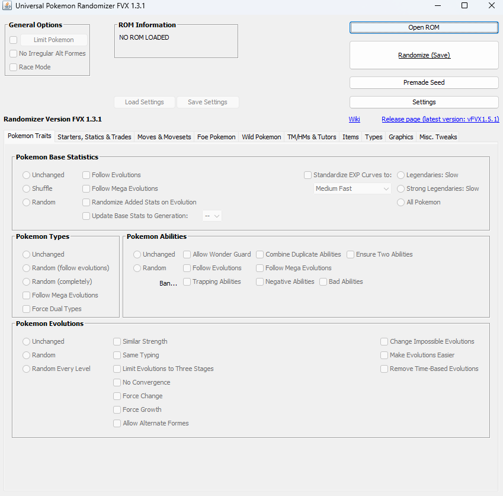
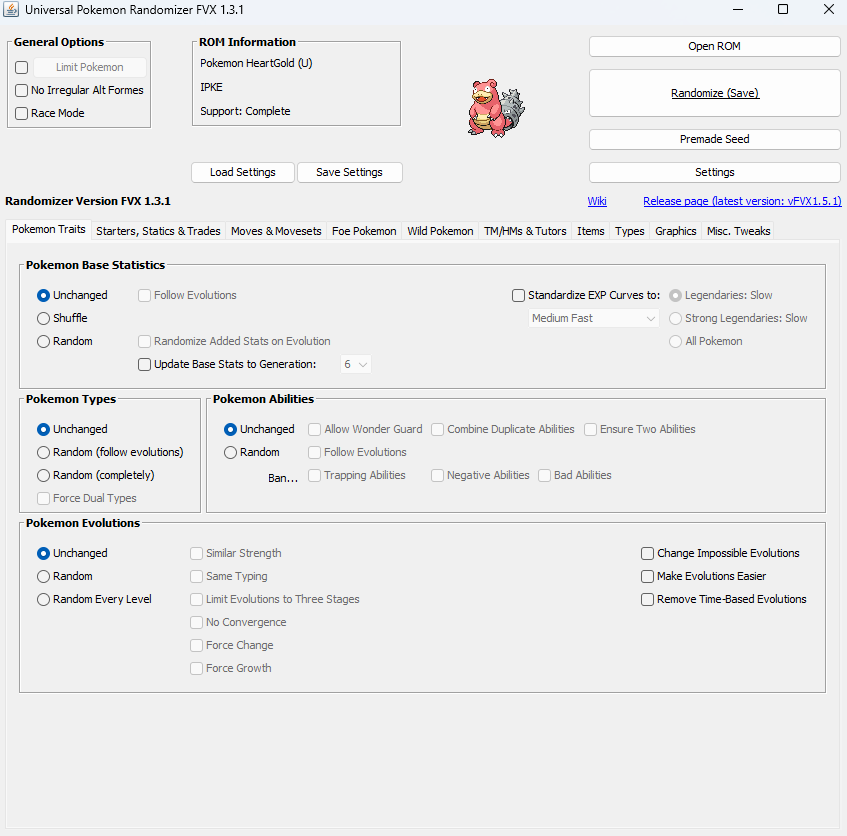

# Welcome to the (hopefully) GS Hub for the Universal Pokemon Randomizer!

I'm hoping to make this a long-term thing if possible, but I will have the Randomizer hosted here. Please use the following steps to get this set up:

### STEP 1: Download the UPR_FVX_v1.3.1 .zip file.

### STEP 2: Extract into a folder/directory of your choice.

### STEP 3: Click on the necessary launcher to start the UPR.
* For Windows, use the launcher_WINDOWS.bat file
* For Mac, use the launcher_MAC.command file
* For Linux, use the launcher_UNIX.sh file

### STEP 4: Set your randomized seed.
1. When prompted, open your desired ROM file (This UPR will work with generations 1-7).

2. You can select any randomized traits you want in regards to general gameplay.

3. Hit "Randomize (Save)" and save the randomized file to your location of choice.

If you want some ROMS, there may be a surprise [here](https://drive.google.com/drive/folders/1Ee1U-K8JU-y2n1myfmylG-XjGPH0YEek?usp=drive_link)!

Hope you have fun!
